# Dibdib Advocacy 

Dibdib Advocacy App (v2.0) is a Breast Cancer awareness application for spreading awareness and helping Filipino women fight against breast cancer. Breast cancer is the most common cancer affecting women worldwide. Philippines is among the countries with highest trends in incidence of the disease. Majority of deaths occur in low- and middle-income countries, where most women are diagnosed in late stages, due mainly to lack of awareness on early detection, and barriers to health services. This app includes basic facts, risk factors, inspection guide, palpation video, integrated with Google Maps, Android's Text-to-Speech API and Image processing, providing a fully integrated app experience. 

This app is developed and maintained by the Intelligent Systems Laboratory of De La Salle University-Manila under the Philippine Commission of Higher Education (CHED)- Philippine Research Network (PHERNET) Sustainability Studies Program.   


# INCLUDES:
- Basic Breast Cancer Facts and Recommendation
- Common Risk Factors
- Tips on lowering the risk
- Visual inspection guide
- Breast Palpation instructions
- Breast Self-Examination video demo 
- Google Map/Places Integration for neighboring hospital search and route guide
- Breast Selfie's (with RGB Preview, Color Histograms, Magnification, Breast Detection by Haar Cascades, Edge detection and Image Gradients based on OpenCV samples)
- Speech-based User Interface feedback (using Android's Text-to-Speech API)


# GOOGLE PLAY

https://play.google.com/store/apps/details?id=com.cabatuan.breastfriend 


# CORE APP DEVELOPER:
```text
Melvin K. Cabatuan
Member, Intelligent Systems Laboratory
Mobile Application Development Team Leader
Email: melvincabatuan@gmail.com
All Rights Reserved
```

# ACKNOWLEDGMENT:
- Philippine Commission of Higher Education (CHED)- Philippine Research Network (PHERNET) Sustainability Studies Program for the gracious funding of this project.
- Breast Cancer Awareness Integrated/Intelligent Multimedia System idea by Dr. Elmer Dadios, Ph.D, head of Intelligent Systems Laboratory, De La Salle University-Manila, and Dr. Raouf Naguib, Ph. D., BIOCORE Research & Consultancy International, De La Salle University, Carleton University.
- Breast Self-Examination video demo by Dr. Reynaldo O. Joson, MD. and Engr. Anthony Jose.
- Visual inspection infographic from CancerResearch UK (www.cancerresearchuk.org)
- Icons used are GitHub's Octicons (https://github.com/github/octicons) modified with romannurik's Android Asset Studio (https://github.com/romannurik/AndroidAssetStudio).
- Google Android Development Team for the SDK, NDK, and great API's, i.e. Google Map/Places, Text-to-Speech, etc. 
- OpenCV Development Team for the great computer vision library


# LICENSE

```text
The MIT License (MIT)

Copyright (c) Melvin Cabatuan

Permission is hereby granted, free of charge, to any person obtaining a copy
of this software and associated documentation files (the "Software"), to deal
in the Software without restriction, including without limitation the rights
to use, copy, modify, merge, publish, distribute, sublicense, and/or sell
copies of the Software, and to permit persons to whom the Software is
furnished to do so, subject to the following conditions:

The above copyright notice and this permission notice shall be included in all
copies or substantial portions of the Software.

THE SOFTWARE IS PROVIDED "AS IS", WITHOUT WARRANTY OF ANY KIND, EXPRESS OR
IMPLIED, INCLUDING BUT NOT LIMITED TO THE WARRANTIES OF MERCHANTABILITY,
FITNESS FOR A PARTICULAR PURPOSE AND NONINFRINGEMENT. IN NO EVENT SHALL THE
AUTHORS OR COPYRIGHT HOLDERS BE LIABLE FOR ANY CLAIM, DAMAGES OR OTHER
LIABILITY, WHETHER IN AN ACTION OF CONTRACT, TORT OR OTHERWISE, ARISING FROM,
OUT OF OR IN CONNECTION WITH THE SOFTWARE OR THE USE OR OTHER DEALINGS IN THE
SOFTWARE.
```

# VIDEOCAPTURES

[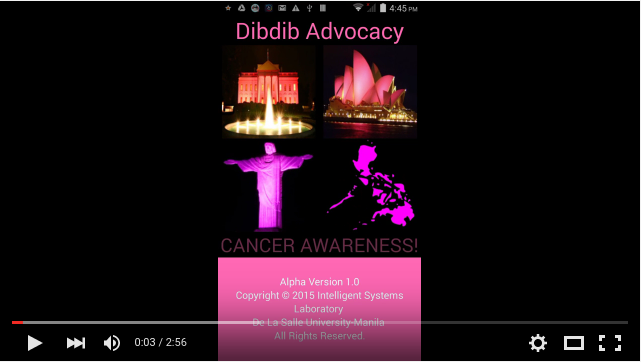](https://youtu.be/p6PartliODg)

[](https://youtu.be/booLbrq6S_E)

# SELECTED SCREENSHOTS

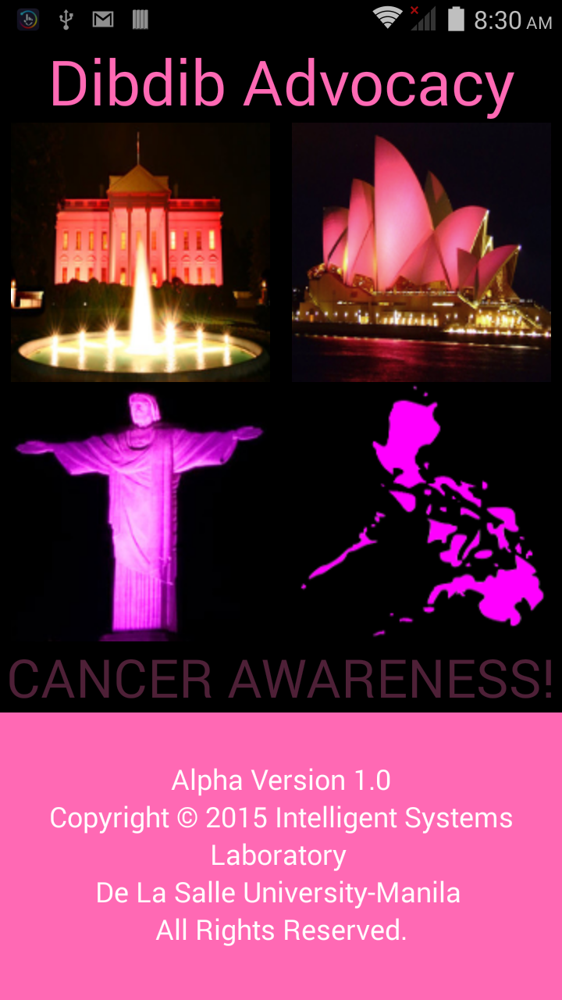
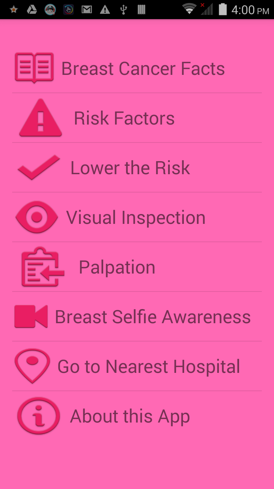
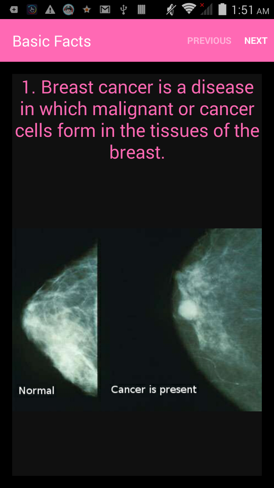
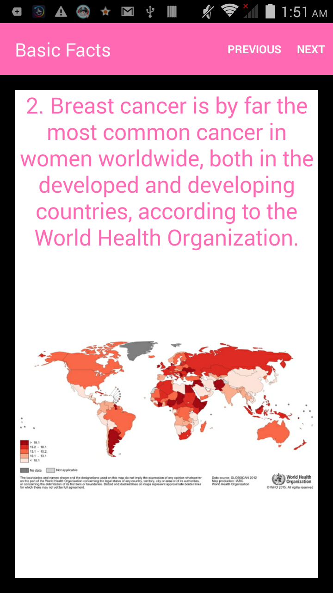
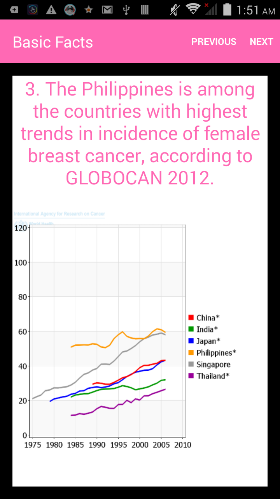
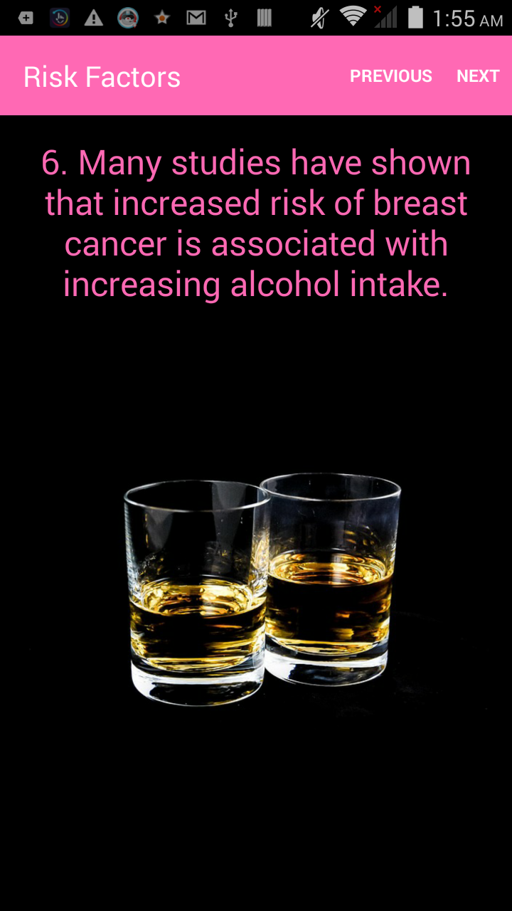
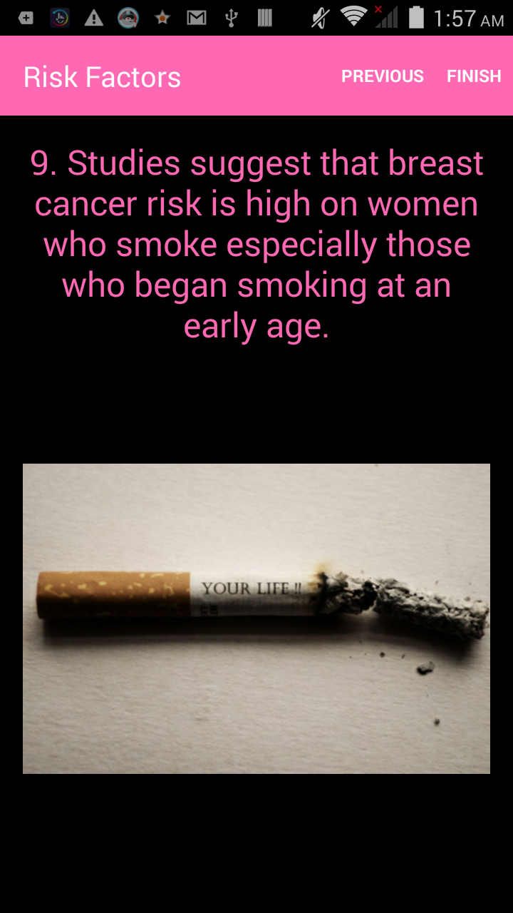

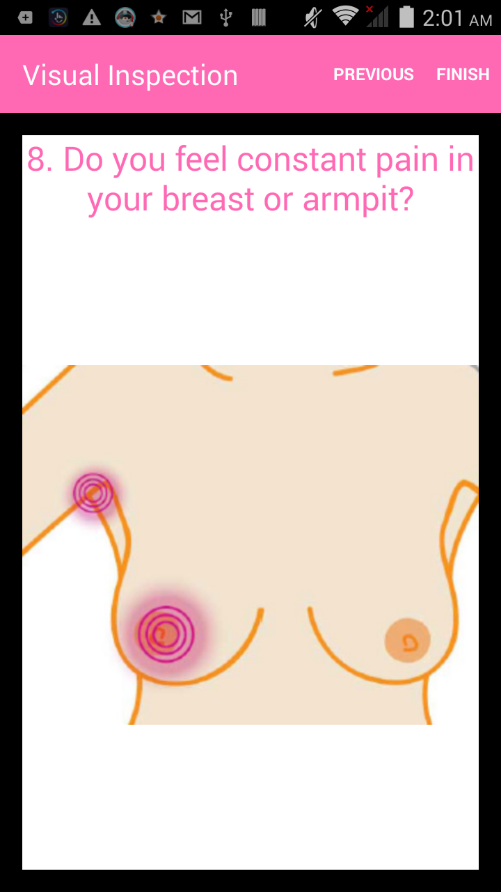

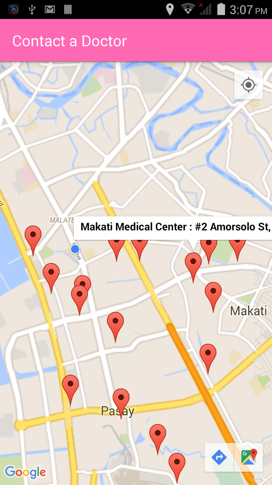
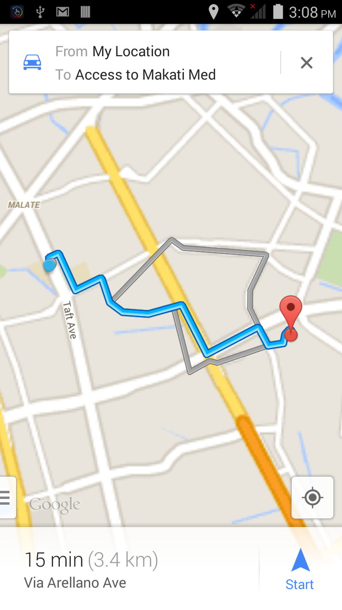
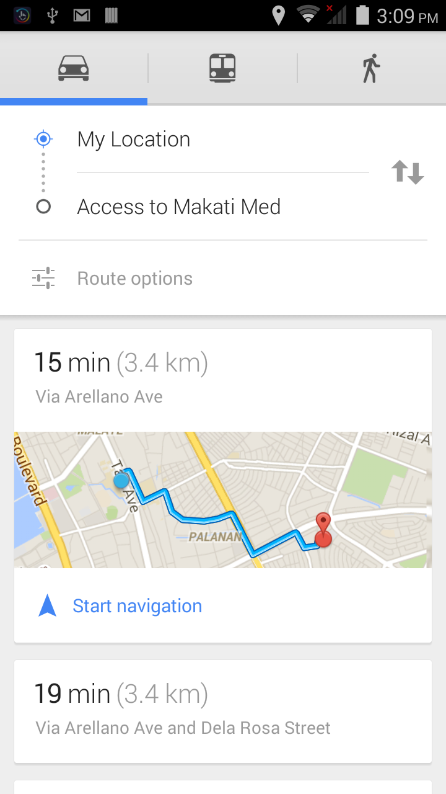


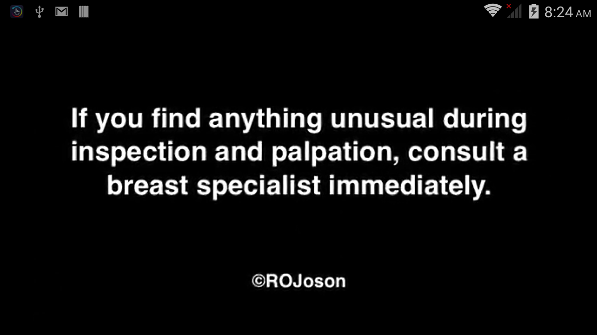
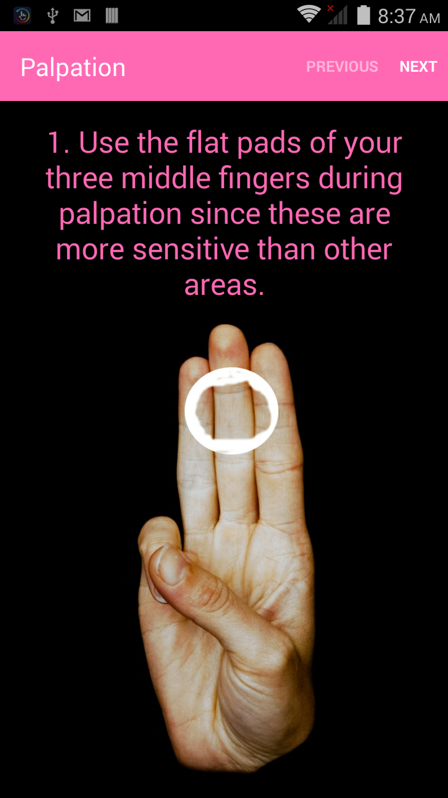
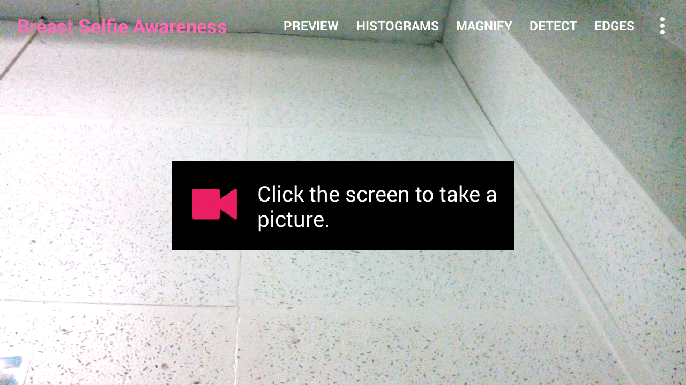
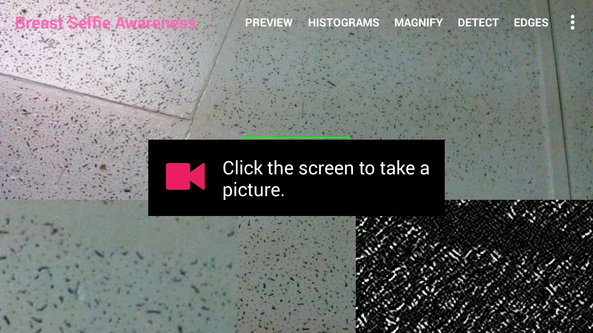
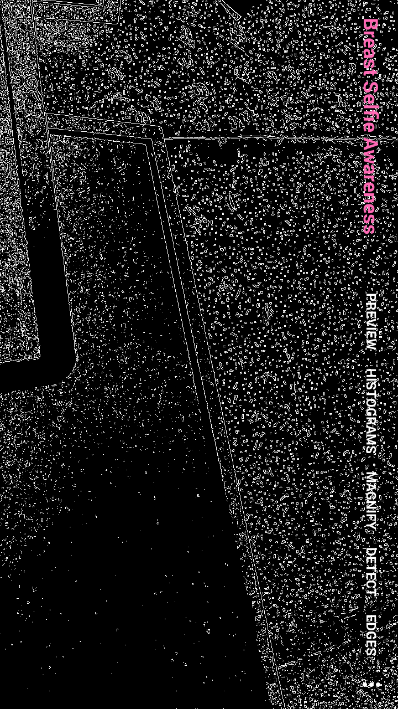
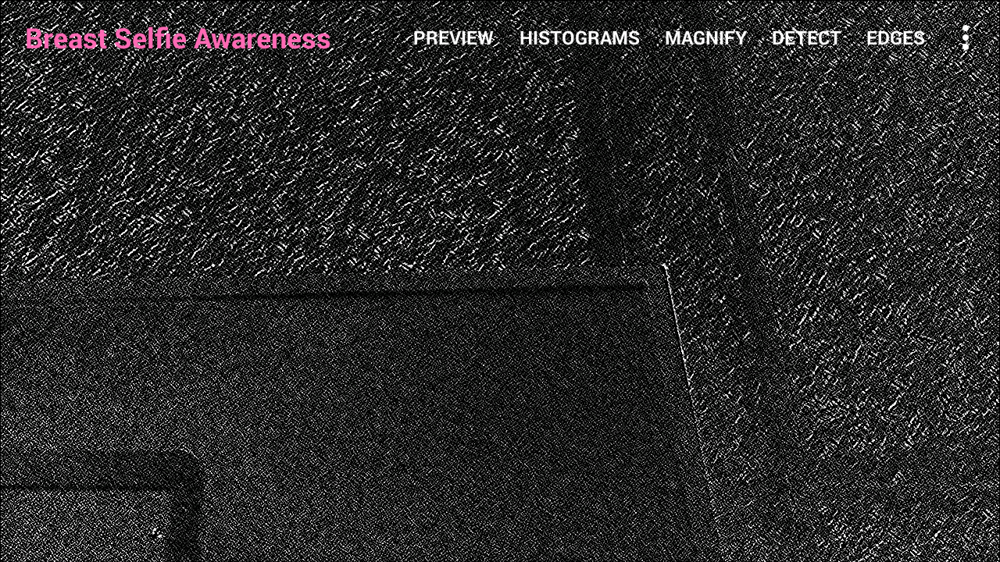


# REFERENCES:

[1] International Agency for Research on Cancer (IARC) and Cancer Research UK."
World Cancer Factsheet". Cancer Research UK, London, 2012.

[2] World Health Organization. http://www.who.int 

[3] THE GLOBOCAN PROJECT, International Agency for Research on Cancer (IARC)/WHO. http://globocan.iarc.fr

[4] Philippine College of Surgeons. http://pcs.org.ph

[5] Philippine Breast Cancer Network. http://www.pbcn.org

[6] M.H. Forouzanfar, K.J. Foreman, A.M. Delossantos, R. Lozano, A.D. Lopez, C.J.L.
Murray, M. Naghavi, "Breast and cervical cancer in 187 countries between 1980 and 2010:
a systematic analysis," The Lancet, Volume 378, Issue 9801, pp. 1461 - 1484, 22, 2011.

[7] Department of Health, National Epidemiology Center, National Health Statistics Report
2008 and 2009.

[8] Yip C. H. "Breast cancer in Asia", Dept. of Surgery University Malaya Medical Centre,
Lecture Presentation, 2012.

[9] P. Pisani, D.M. Parkin, C. Ngelangel, D. Esteban, L. Gibson, M. Munson, M.G. Reyes
and A. Laudico. Outcome of screening by clinical examination of the breast in a trial in the
Philippines. Int. J. Cancer, 118:149-154, 2006.

[10] ICANSERVE Foundation. http://www.icanservefoundation.org

[11] Dr. Reynaldo O. Joson's Medical blog. https://rojosonmedicalclinic.wordpress.com


# EXTRA (zipaligning the apk)

```shell
$ /home/cobalt/Android/Sdk/build-tools/23.0.2/zipalign -f -v 4 app-release-unaligned.apk dibdibadvocacy.apk
Verifying alignment of dibdibadvocacy.apk (4)...
      53 AndroidManifest.xml (OK - compressed)
    2548 assets/BMare.mp3 (OK)
  194862 res/anim/abc_fade_in.xml (OK - compressed)
  195152 res/anim/abc_fade_out.xml (OK - compressed)
  195459 res/anim/abc_grow_fade_in_from_bottom.xml (OK - compressed)
  195919 res/anim/abc_popup_enter.xml (OK - compressed)
  196255 res/anim/abc_popup_exit.xml (OK - compressed)
  196610 res/anim/abc_shrink_fade_out_from_bottom.xml (OK - compressed)
  197072 res/anim/abc_slide_in_bottom.xml (OK - compressed)
  197373 res/anim/abc_slide_in_top.xml (OK - compressed)
  197678 res/anim/abc_slide_out_bottom.xml (OK - compressed)
  197979 res/anim/abc_slide_out_top.xml (OK - compressed)
  198275 res/anim/custom_anim.xml (OK - compressed)
  198779 res/anim/fab_in.xml (OK - compressed)
  199159 res/anim/fab_out.xml (OK - compressed)
  199542 res/anim/fade_in.xml (OK - compressed)
  199853 res/anim/fade_in2.xml (OK - compressed)
  200189 res/anim/snackbar_in.xml (OK - compressed)
  200446 res/anim/snackbar_out.xml (OK - compressed)
  200742 res/color-v11/abc_background_cache_hint_selector_material_dark.xml (OK - compressed)
  201087 res/color-v11/abc_background_cache_hint_selector_material_light.xml (OK - compressed)
  201427 res/color/abc_background_cache_hint_selector_material_dark.xml (OK - compressed)
  201719 res/color/abc_background_cache_hint_selector_material_light.xml (OK - compressed)
  202005 res/color/abc_primary_text_disable_only_material_dark.xml (OK - compressed)
  202337 res/color/abc_primary_text_disable_only_material_light.xml (OK - compressed)
  202656 res/color/abc_primary_text_material_dark.xml (OK - compressed)
  202977 res/color/abc_primary_text_material_light.xml (OK - compressed)
  203287 res/color/abc_search_url_text.xml (OK - compressed)
  203634 res/color/abc_secondary_text_material_dark.xml (OK - compressed)
  203956 res/color/abc_secondary_text_material_light.xml (OK - compressed)
  204272 res/color/common_signin_btn_text_dark.xml (OK - compressed)
  204661 res/color/common_signin_btn_text_light.xml (OK - compressed)
  205049 res/color/switch_thumb_material_dark.xml (OK - compressed)
  205367 res/color/switch_thumb_material_light.xml (OK - compressed)
  205688 res/color/wallet_primary_text_holo_light.xml (OK - compressed)
  206086 res/color/wallet_secondary_text_holo_dark.xml (OK - compressed)
  206536 res/drawable-hdpi-v4/abc_ab_share_pack_mtrl_alpha.9.png (OK)
  206908 res/drawable-hdpi-v4/abc_btn_check_to_on_mtrl_000.png (OK)
  207300 res/drawable-hdpi-v4/abc_btn_check_to_on_mtrl_015.png (OK)
  207932 res/drawable-hdpi-v4/abc_btn_radio_to_on_mtrl_000.png (OK)
  208640 res/drawable-hdpi-v4/abc_btn_radio_to_on_mtrl_015.png (OK)
  209484 res/drawable-hdpi-v4/abc_btn_rating_star_off_mtrl_alpha.png (OK)
  211192 res/drawable-hdpi-v4/abc_btn_rating_star_on_mtrl_alpha.png (OK)
  212360 res/drawable-hdpi-v4/abc_btn_switch_to_on_mtrl_00001.9.png (OK)
  213996 res/drawable-hdpi-v4/abc_btn_switch_to_on_mtrl_00012.9.png (OK)
  215836 res/drawable-hdpi-v4/abc_cab_background_top_mtrl_alpha.9.png (OK)
  216148 res/drawable-hdpi-v4/abc_ic_ab_back_mtrl_am_alpha.png (OK)
  216644 res/drawable-hdpi-v4/abc_ic_clear_mtrl_alpha.png (OK)
  217016 res/drawable-hdpi-v4/abc_ic_commit_search_api_mtrl_alpha.png (OK)
  217336 res/drawable-hdpi-v4/abc_ic_go_search_api_mtrl_alpha.png (OK)
  217584 res/drawable-hdpi-v4/abc_ic_menu_copy_mtrl_am_alpha.png (OK)
  217956 res/drawable-hdpi-v4/abc_ic_menu_cut_mtrl_alpha.png (OK)
  218660 res/drawable-hdpi-v4/abc_ic_menu_moreoverflow_mtrl_alpha.png (OK)
  218936 res/drawable-hdpi-v4/abc_ic_menu_paste_mtrl_am_alpha.png (OK)
  219396 res/drawable-hdpi-v4/abc_ic_menu_selectall_mtrl_alpha.png (OK)
  219752 res/drawable-hdpi-v4/abc_ic_menu_share_mtrl_alpha.png (OK)
  220628 res/drawable-hdpi-v4/abc_ic_search_api_mtrl_alpha.png (OK)
  221748 res/drawable-hdpi-v4/abc_ic_voice_search_api_mtrl_alpha.png (OK)
  222376 res/drawable-hdpi-v4/abc_list_divider_mtrl_alpha.9.png (OK)
  222624 res/drawable-hdpi-v4/abc_list_focused_holo.9.png (OK)
  222952 res/drawable-hdpi-v4/abc_list_longpressed_holo.9.png (OK)
  223248 res/drawable-hdpi-v4/abc_list_pressed_holo_dark.9.png (OK)
  223544 res/drawable-hdpi-v4/abc_list_pressed_holo_light.9.png (OK)
  223852 res/drawable-hdpi-v4/abc_list_selector_disabled_holo_dark.9.png (OK)
  224188 res/drawable-hdpi-v4/abc_list_selector_disabled_holo_light.9.png (OK)
  224520 res/drawable-hdpi-v4/abc_menu_hardkey_panel_mtrl_mult.9.png (OK)
  225448 res/drawable-hdpi-v4/abc_popup_background_mtrl_mult.9.png (OK)
  226820 res/drawable-hdpi-v4/abc_spinner_mtrl_am_alpha.9.png (OK)
  227296 res/drawable-hdpi-v4/abc_switch_track_mtrl_alpha.9.png (OK)
  227916 res/drawable-hdpi-v4/abc_tab_indicator_mtrl_alpha.9.png (OK)
  228200 res/drawable-hdpi-v4/abc_text_cursor_mtrl_alpha.9.png (OK)
  228532 res/drawable-hdpi-v4/abc_textfield_activated_mtrl_alpha.9.png (OK)
  228816 res/drawable-hdpi-v4/abc_textfield_default_mtrl_alpha.9.png (OK)
  229116 res/drawable-hdpi-v4/abc_textfield_search_activated_mtrl_alpha.9.png (OK)
  229396 res/drawable-hdpi-v4/abc_textfield_search_default_mtrl_alpha.9.png (OK)
  229656 res/drawable-hdpi-v4/cast_ic_notification_0.png (OK)
  230212 res/drawable-hdpi-v4/cast_ic_notification_1.png (OK)
  230784 res/drawable-hdpi-v4/cast_ic_notification_2.png (OK)
  231400 res/drawable-hdpi-v4/cast_ic_notification_on.png (OK)
  232068 res/drawable-hdpi-v4/common_full_open_on_phone.png (OK)
  232648 res/drawable-hdpi-v4/common_ic_googleplayservices.png (OK)
  237812 res/drawable-hdpi-v4/common_signin_btn_icon_disabled_dark.9.png (OK)
  239660 res/drawable-hdpi-v4/common_signin_btn_icon_disabled_focus_dark.9.png (OK)
  241532 res/drawable-hdpi-v4/common_signin_btn_icon_disabled_focus_light.9.png (OK)
  243396 res/drawable-hdpi-v4/common_signin_btn_icon_disabled_light.9.png (OK)
  245236 res/drawable-hdpi-v4/common_signin_btn_icon_focus_dark.9.png (OK)
  247392 res/drawable-hdpi-v4/common_signin_btn_icon_focus_light.9.png (OK)
  249528 res/drawable-hdpi-v4/common_signin_btn_icon_normal_dark.9.png (OK)
  251656 res/drawable-hdpi-v4/common_signin_btn_icon_normal_light.9.png (OK)
  253764 res/drawable-hdpi-v4/common_signin_btn_icon_pressed_dark.9.png (OK)
  256056 res/drawable-hdpi-v4/common_signin_btn_icon_pressed_light.9.png (OK)
  258480 res/drawable-hdpi-v4/common_signin_btn_text_disabled_dark.9.png (OK)
  260456 res/drawable-hdpi-v4/common_signin_btn_text_disabled_focus_dark.9.png (OK)
  262456 res/drawable-hdpi-v4/common_signin_btn_text_disabled_focus_light.9.png (OK)
  264452 res/drawable-hdpi-v4/common_signin_btn_text_disabled_light.9.png (OK)
  266420 res/drawable-hdpi-v4/common_signin_btn_text_focus_dark.9.png (OK)
  268680 res/drawable-hdpi-v4/common_signin_btn_text_focus_light.9.png (OK)
  270928 res/drawable-hdpi-v4/common_signin_btn_text_normal_dark.9.png (OK)
  273184 res/drawable-hdpi-v4/common_signin_btn_text_normal_light.9.png (OK)
  275412 res/drawable-hdpi-v4/common_signin_btn_text_pressed_dark.9.png (OK)
  277848 res/drawable-hdpi-v4/common_signin_btn_text_pressed_light.9.png (OK)
  280376 res/drawable-hdpi-v4/ic_cast_dark.png (OK)
  281508 res/drawable-hdpi-v4/ic_cast_disabled_light.png (OK)
  282252 res/drawable-hdpi-v4/ic_cast_light.png (OK)
  283372 res/drawable-hdpi-v4/ic_cast_off_light.png (OK)
  284340 res/drawable-hdpi-v4/ic_cast_on_0_light.png (OK)
  285404 res/drawable-hdpi-v4/ic_cast_on_1_light.png (OK)
  286524 res/drawable-hdpi-v4/ic_cast_on_2_light.png (OK)
  287672 res/drawable-hdpi-v4/ic_cast_on_light.png (OK)
  288788 res/drawable-hdpi-v4/ic_media_pause.png (OK)
  289212 res/drawable-hdpi-v4/ic_media_play.png (OK)
  290336 res/drawable-hdpi-v4/ic_media_route_disabled_mono_dark.png (OK)
  291108 res/drawable-hdpi-v4/ic_media_route_off_mono_dark.png (OK)
  292108 res/drawable-hdpi-v4/ic_media_route_on_0_mono_dark.png (OK)
  293200 res/drawable-hdpi-v4/ic_media_route_on_1_mono_dark.png (OK)
  294312 res/drawable-hdpi-v4/ic_media_route_on_2_mono_dark.png (OK)
  295492 res/drawable-hdpi-v4/ic_media_route_on_mono_dark.png (OK)
  296604 res/drawable-hdpi-v4/ic_pause_dark.png (OK)
  296900 res/drawable-hdpi-v4/ic_pause_light.png (OK)
  297176 res/drawable-hdpi-v4/ic_play_dark.png (OK)
  297684 res/drawable-hdpi-v4/ic_play_light.png (OK)
  298180 res/drawable-hdpi-v4/ic_plusone_medium_off_client.png (OK)
  298696 res/drawable-hdpi-v4/ic_plusone_small_off_client.png (OK)
  299356 res/drawable-hdpi-v4/ic_plusone_standard_off_client.png (OK)
  299888 res/drawable-hdpi-v4/ic_plusone_tall_off_client.png (OK)
  300404 res/drawable-hdpi-v4/ic_setting_dark.png (OK)
  301328 res/drawable-hdpi-v4/ic_setting_light.png (OK)
  302272 res/drawable-hdpi-v4/mr_ic_audio_vol.png (OK)
  303664 res/drawable-hdpi-v4/powered_by_google_dark.png (OK)
  306096 res/drawable-hdpi-v4/powered_by_google_light.png (OK)
  309616 res/drawable-ldrtl-hdpi-v4/abc_ic_ab_back_mtrl_am_alpha.png (OK)
  310092 res/drawable-ldrtl-hdpi-v4/abc_ic_menu_copy_mtrl_am_alpha.png (OK)
  310468 res/drawable-ldrtl-hdpi-v4/abc_ic_menu_cut_mtrl_alpha.png (OK)
  311168 res/drawable-ldrtl-hdpi-v4/abc_spinner_mtrl_am_alpha.9.png (OK)
  311648 res/drawable-ldrtl-mdpi-v4/abc_ic_ab_back_mtrl_am_alpha.png (OK)
  312064 res/drawable-ldrtl-mdpi-v4/abc_ic_menu_copy_mtrl_am_alpha.png (OK)
  312328 res/drawable-ldrtl-mdpi-v4/abc_ic_menu_cut_mtrl_alpha.png (OK)
  312800 res/drawable-ldrtl-mdpi-v4/abc_spinner_mtrl_am_alpha.9.png (OK)
  313244 res/drawable-ldrtl-xhdpi-v4/abc_ic_ab_back_mtrl_am_alpha.png (OK)
  313764 res/drawable-ldrtl-xhdpi-v4/abc_ic_menu_copy_mtrl_am_alpha.png (OK)
  314092 res/drawable-ldrtl-xhdpi-v4/abc_ic_menu_cut_mtrl_alpha.png (OK)
  314912 res/drawable-ldrtl-xhdpi-v4/abc_spinner_mtrl_am_alpha.9.png (OK)
  315508 res/drawable-ldrtl-xxhdpi-v4/abc_ic_ab_back_mtrl_am_alpha.png (OK)
  316076 res/drawable-ldrtl-xxhdpi-v4/abc_ic_menu_copy_mtrl_am_alpha.png (OK)
  316528 res/drawable-ldrtl-xxhdpi-v4/abc_ic_menu_cut_mtrl_alpha.png (OK)
  317612 res/drawable-ldrtl-xxhdpi-v4/abc_spinner_mtrl_am_alpha.9.png (OK)
  318336 res/drawable-ldrtl-xxxhdpi-v4/abc_ic_ab_back_mtrl_am_alpha.png (OK)
  318676 res/drawable-ldrtl-xxxhdpi-v4/abc_ic_menu_copy_mtrl_am_alpha.png (OK)
  319184 res/drawable-ldrtl-xxxhdpi-v4/abc_ic_menu_cut_mtrl_alpha.png (OK)
  320532 res/drawable-ldrtl-xxxhdpi-v4/abc_spinner_mtrl_am_alpha.9.png (OK)
  321228 res/drawable-mdpi-v4/abc_ab_share_pack_mtrl_alpha.9.png (OK)
  321588 res/drawable-mdpi-v4/abc_btn_check_to_on_mtrl_000.png (OK)
  321960 res/drawable-mdpi-v4/abc_btn_check_to_on_mtrl_015.png (OK)
  322472 res/drawable-mdpi-v4/abc_btn_radio_to_on_mtrl_000.png (OK)
  322984 res/drawable-mdpi-v4/abc_btn_radio_to_on_mtrl_015.png (OK)
  323568 res/drawable-mdpi-v4/abc_btn_rating_star_off_mtrl_alpha.png (OK)
  325004 res/drawable-mdpi-v4/abc_btn_rating_star_on_mtrl_alpha.png (OK)
  326100 res/drawable-mdpi-v4/abc_btn_switch_to_on_mtrl_00001.9.png (OK)
  327236 res/drawable-mdpi-v4/abc_btn_switch_to_on_mtrl_00012.9.png (OK)
  328452 res/drawable-mdpi-v4/abc_cab_background_top_mtrl_alpha.9.png (OK)
  328760 res/drawable-mdpi-v4/abc_ic_ab_back_mtrl_am_alpha.png (OK)
  329192 res/drawable-mdpi-v4/abc_ic_clear_mtrl_alpha.png (OK)
  329520 res/drawable-mdpi-v4/abc_ic_commit_search_api_mtrl_alpha.png (OK)
  329888 res/drawable-mdpi-v4/abc_ic_go_search_api_mtrl_alpha.png (OK)
  330132 res/drawable-mdpi-v4/abc_ic_menu_copy_mtrl_am_alpha.png (OK)
  330400 res/drawable-mdpi-v4/abc_ic_menu_cut_mtrl_alpha.png (OK)
  330868 res/drawable-mdpi-v4/abc_ic_menu_moreoverflow_mtrl_alpha.png (OK)
  331112 res/drawable-mdpi-v4/abc_ic_menu_paste_mtrl_am_alpha.png (OK)
  331436 res/drawable-mdpi-v4/abc_ic_menu_selectall_mtrl_alpha.png (OK)
  331708 res/drawable-mdpi-v4/abc_ic_menu_share_mtrl_alpha.png (OK)
  332336 res/drawable-mdpi-v4/abc_ic_search_api_mtrl_alpha.png (OK)
  333108 res/drawable-mdpi-v4/abc_ic_voice_search_api_mtrl_alpha.png (OK)
  333608 res/drawable-mdpi-v4/abc_list_divider_mtrl_alpha.9.png (OK)
  333856 res/drawable-mdpi-v4/abc_list_focused_holo.9.png (OK)
  334160 res/drawable-mdpi-v4/abc_list_longpressed_holo.9.png (OK)
  334456 res/drawable-mdpi-v4/abc_list_pressed_holo_dark.9.png (OK)
  334752 res/drawable-mdpi-v4/abc_list_pressed_holo_light.9.png (OK)
  335056 res/drawable-mdpi-v4/abc_list_selector_disabled_holo_dark.9.png (OK)
  335376 res/drawable-mdpi-v4/abc_list_selector_disabled_holo_light.9.png (OK)
  335692 res/drawable-mdpi-v4/abc_menu_hardkey_panel_mtrl_mult.9.png (OK)
  336384 res/drawable-mdpi-v4/abc_popup_background_mtrl_mult.9.png (OK)
  337332 res/drawable-mdpi-v4/abc_spinner_mtrl_am_alpha.9.png (OK)
  337772 res/drawable-mdpi-v4/abc_switch_track_mtrl_alpha.9.png (OK)
  338284 res/drawable-mdpi-v4/abc_tab_indicator_mtrl_alpha.9.png (OK)
  338560 res/drawable-mdpi-v4/abc_text_cursor_mtrl_alpha.9.png (OK)
  338880 res/drawable-mdpi-v4/abc_textfield_activated_mtrl_alpha.9.png (OK)
  339156 res/drawable-mdpi-v4/abc_textfield_default_mtrl_alpha.9.png (OK)
  339440 res/drawable-mdpi-v4/abc_textfield_search_activated_mtrl_alpha.9.png (OK)
  339720 res/drawable-mdpi-v4/abc_textfield_search_default_mtrl_alpha.9.png (OK)
  339980 res/drawable-mdpi-v4/cast_ic_notification_0.png (OK)
  340424 res/drawable-mdpi-v4/cast_ic_notification_1.png (OK)
  340888 res/drawable-mdpi-v4/cast_ic_notification_2.png (OK)
  341356 res/drawable-mdpi-v4/cast_ic_notification_on.png (OK)
  341884 res/drawable-mdpi-v4/common_full_open_on_phone.png (OK)
  342720 res/drawable-mdpi-v4/common_signin_btn_icon_disabled_dark.9.png (OK)
  344072 res/drawable-mdpi-v4/common_signin_btn_icon_disabled_focus_dark.9.png (OK)
  345452 res/drawable-mdpi-v4/common_signin_btn_icon_disabled_focus_light.9.png (OK)
  346828 res/drawable-mdpi-v4/common_signin_btn_icon_disabled_light.9.png (OK)
  348172 res/drawable-mdpi-v4/common_signin_btn_icon_focus_dark.9.png (OK)
  349708 res/drawable-mdpi-v4/common_signin_btn_icon_focus_light.9.png (OK)
  351224 res/drawable-mdpi-v4/common_signin_btn_icon_normal_dark.9.png (OK)
  352756 res/drawable-mdpi-v4/common_signin_btn_icon_normal_light.9.png (OK)
  354260 res/drawable-mdpi-v4/common_signin_btn_icon_pressed_dark.9.png (OK)
  355884 res/drawable-mdpi-v4/common_signin_btn_icon_pressed_light.9.png (OK)
  357568 res/drawable-mdpi-v4/common_signin_btn_text_disabled_dark.9.png (OK)
  358988 res/drawable-mdpi-v4/common_signin_btn_text_disabled_focus_dark.9.png (OK)
  360404 res/drawable-mdpi-v4/common_signin_btn_text_disabled_focus_light.9.png (OK)
  361816 res/drawable-mdpi-v4/common_signin_btn_text_disabled_light.9.png (OK)
  363228 res/drawable-mdpi-v4/common_signin_btn_text_focus_dark.9.png (OK)
  364796 res/drawable-mdpi-v4/common_signin_btn_text_focus_light.9.png (OK)
  366372 res/drawable-mdpi-v4/common_signin_btn_text_normal_dark.9.png (OK)
  367972 res/drawable-mdpi-v4/common_signin_btn_text_normal_light.9.png (OK)
  369548 res/drawable-mdpi-v4/common_signin_btn_text_pressed_dark.9.png (OK)
  371224 res/drawable-mdpi-v4/common_signin_btn_text_pressed_light.9.png (OK)
  372928 res/drawable-mdpi-v4/ic_cast_dark.png (OK)
  373788 res/drawable-mdpi-v4/ic_cast_disabled_light.png (OK)
  374344 res/drawable-mdpi-v4/ic_cast_light.png (OK)
  375192 res/drawable-mdpi-v4/ic_cast_off_light.png (OK)
  375940 res/drawable-mdpi-v4/ic_cast_on_0_light.png (OK)
  376744 res/drawable-mdpi-v4/ic_cast_on_1_light.png (OK)
  377584 res/drawable-mdpi-v4/ic_cast_on_2_light.png (OK)
  378424 res/drawable-mdpi-v4/ic_cast_on_light.png (OK)
  379264 res/drawable-mdpi-v4/ic_media_pause.png (OK)
  379640 res/drawable-mdpi-v4/ic_media_play.png (OK)
  380488 res/drawable-mdpi-v4/ic_media_route_disabled_mono_dark.png (OK)
  381072 res/drawable-mdpi-v4/ic_media_route_off_mono_dark.png (OK)
  381852 res/drawable-mdpi-v4/ic_media_route_on_0_mono_dark.png (OK)
  382676 res/drawable-mdpi-v4/ic_media_route_on_1_mono_dark.png (OK)
  383532 res/drawable-mdpi-v4/ic_media_route_on_2_mono_dark.png (OK)
  384416 res/drawable-mdpi-v4/ic_media_route_on_mono_dark.png (OK)
  385280 res/drawable-mdpi-v4/ic_pause_dark.png (OK)
  385556 res/drawable-mdpi-v4/ic_pause_light.png (OK)
  385816 res/drawable-mdpi-v4/ic_play_dark.png (OK)
  386204 res/drawable-mdpi-v4/ic_play_light.png (OK)
  386612 res/drawable-mdpi-v4/ic_plusone_medium_off_client.png (OK)
  387036 res/drawable-mdpi-v4/ic_plusone_small_off_client.png (OK)
  387424 res/drawable-mdpi-v4/ic_plusone_standard_off_client.png (OK)
  387884 res/drawable-mdpi-v4/ic_plusone_tall_off_client.png (OK)
  388304 res/drawable-mdpi-v4/ic_setting_dark.png (OK)
  388964 res/drawable-mdpi-v4/ic_setting_light.png (OK)
  389640 res/drawable-mdpi-v4/mr_ic_audio_vol.png (OK)
  390648 res/drawable-mdpi-v4/powered_by_google_dark.png (OK)
  392096 res/drawable-mdpi-v4/powered_by_google_light.png (OK)
  394116 res/drawable-tvdpi-v4/common_full_open_on_phone.png (OK)
  394696 res/drawable-tvdpi-v4/ic_plusone_medium_off_client.png (OK)
  395188 res/drawable-tvdpi-v4/ic_plusone_small_off_client.png (OK)
  395704 res/drawable-tvdpi-v4/ic_plusone_standard_off_client.png (OK)
  396216 res/drawable-tvdpi-v4/ic_plusone_tall_off_client.png (OK)
  396748 res/drawable-xhdpi-v4/abc_ab_share_pack_mtrl_alpha.9.png (OK)
  397132 res/drawable-xhdpi-v4/abc_btn_check_to_on_mtrl_000.png (OK)
  397572 res/drawable-xhdpi-v4/abc_btn_check_to_on_mtrl_015.png (OK)
  398212 res/drawable-xhdpi-v4/abc_btn_radio_to_on_mtrl_000.png (OK)
  399128 res/drawable-xhdpi-v4/abc_btn_radio_to_on_mtrl_015.png (OK)
  400216 res/drawable-xhdpi-v4/abc_btn_rating_star_off_mtrl_alpha.png (OK)
  402520 res/drawable-xhdpi-v4/abc_btn_rating_star_on_mtrl_alpha.png (OK)
  404156 res/drawable-xhdpi-v4/abc_btn_switch_to_on_mtrl_00001.9.png (OK)
  406504 res/drawable-xhdpi-v4/abc_btn_switch_to_on_mtrl_00012.9.png (OK)
  409204 res/drawable-xhdpi-v4/abc_cab_background_top_mtrl_alpha.9.png (OK)
  409524 res/drawable-xhdpi-v4/abc_ic_ab_back_mtrl_am_alpha.png (OK)
  410088 res/drawable-xhdpi-v4/abc_ic_clear_mtrl_alpha.png (OK)
  410544 res/drawable-xhdpi-v4/abc_ic_commit_search_api_mtrl_alpha.png (OK)
  410976 res/drawable-xhdpi-v4/abc_ic_go_search_api_mtrl_alpha.png (OK)
  411252 res/drawable-xhdpi-v4/abc_ic_menu_copy_mtrl_am_alpha.png (OK)
  411572 res/drawable-xhdpi-v4/abc_ic_menu_cut_mtrl_alpha.png (OK)
  412388 res/drawable-xhdpi-v4/abc_ic_menu_moreoverflow_mtrl_alpha.png (OK)
  412696 res/drawable-xhdpi-v4/abc_ic_menu_paste_mtrl_am_alpha.png (OK)
  413156 res/drawable-xhdpi-v4/abc_ic_menu_selectall_mtrl_alpha.png (OK)
  413480 res/drawable-xhdpi-v4/abc_ic_menu_share_mtrl_alpha.png (OK)
  414484 res/drawable-xhdpi-v4/abc_ic_search_api_mtrl_alpha.png (OK)
  415708 res/drawable-xhdpi-v4/abc_ic_voice_search_api_mtrl_alpha.png (OK)
  416524 res/drawable-xhdpi-v4/abc_list_divider_mtrl_alpha.9.png (OK)
  416776 res/drawable-xhdpi-v4/abc_list_focused_holo.9.png (OK)
  417104 res/drawable-xhdpi-v4/abc_list_longpressed_holo.9.png (OK)
  417404 res/drawable-xhdpi-v4/abc_list_pressed_holo_dark.9.png (OK)
  417704 res/drawable-xhdpi-v4/abc_list_pressed_holo_light.9.png (OK)
  418012 res/drawable-xhdpi-v4/abc_list_selector_disabled_holo_dark.9.png (OK)
  418364 res/drawable-xhdpi-v4/abc_list_selector_disabled_holo_light.9.png (OK)
  418708 res/drawable-xhdpi-v4/abc_menu_hardkey_panel_mtrl_mult.9.png (OK)
  419940 res/drawable-xhdpi-v4/abc_popup_background_mtrl_mult.9.png (OK)
  421836 res/drawable-xhdpi-v4/abc_spinner_mtrl_am_alpha.9.png (OK)
  422428 res/drawable-xhdpi-v4/abc_switch_track_mtrl_alpha.9.png (OK)
  423276 res/drawable-xhdpi-v4/abc_tab_indicator_mtrl_alpha.9.png (OK)
  423568 res/drawable-xhdpi-v4/abc_text_cursor_mtrl_alpha.9.png (OK)
  423904 res/drawable-xhdpi-v4/abc_textfield_activated_mtrl_alpha.9.png (OK)
  424192 res/drawable-xhdpi-v4/abc_textfield_default_mtrl_alpha.9.png (OK)
  424488 res/drawable-xhdpi-v4/abc_textfield_search_activated_mtrl_alpha.9.png (OK)
  424776 res/drawable-xhdpi-v4/abc_textfield_search_default_mtrl_alpha.9.png (OK)
  425044 res/drawable-xhdpi-v4/cast_ic_notification_0.png (OK)
  425696 res/drawable-xhdpi-v4/cast_ic_notification_1.png (OK)
  426436 res/drawable-xhdpi-v4/cast_ic_notification_2.png (OK)
  427220 res/drawable-xhdpi-v4/cast_ic_notification_on.png (OK)
  428096 res/drawable-xhdpi-v4/common_full_open_on_phone.png (OK)
  428684 res/drawable-xhdpi-v4/common_signin_btn_icon_disabled_dark.9.png (OK)
  431140 res/drawable-xhdpi-v4/common_signin_btn_icon_disabled_focus_dark.9.png (OK)
  433624 res/drawable-xhdpi-v4/common_signin_btn_icon_disabled_focus_light.9.png (OK)
  436104 res/drawable-xhdpi-v4/common_signin_btn_icon_disabled_light.9.png (OK)
  438552 res/drawable-xhdpi-v4/common_signin_btn_icon_focus_dark.9.png (OK)
  441492 res/drawable-xhdpi-v4/common_signin_btn_icon_focus_light.9.png (OK)
  444444 res/drawable-xhdpi-v4/common_signin_btn_icon_normal_dark.9.png (OK)
  447344 res/drawable-xhdpi-v4/common_signin_btn_icon_normal_light.9.png (OK)
  450280 res/drawable-xhdpi-v4/common_signin_btn_icon_pressed_dark.9.png (OK)
  453464 res/drawable-xhdpi-v4/common_signin_btn_icon_pressed_light.9.png (OK)
  456828 res/drawable-xhdpi-v4/common_signin_btn_text_disabled_dark.9.png (OK)
  459408 res/drawable-xhdpi-v4/common_signin_btn_text_disabled_focus_dark.9.png (OK)
  461972 res/drawable-xhdpi-v4/common_signin_btn_text_disabled_focus_light.9.png (OK)
  464532 res/drawable-xhdpi-v4/common_signin_btn_text_disabled_light.9.png (OK)
  467100 res/drawable-xhdpi-v4/common_signin_btn_text_focus_dark.9.png (OK)
  470052 res/drawable-xhdpi-v4/common_signin_btn_text_focus_light.9.png (OK)
  473028 res/drawable-xhdpi-v4/common_signin_btn_text_normal_dark.9.png (OK)
  475988 res/drawable-xhdpi-v4/common_signin_btn_text_normal_light.9.png (OK)
  478960 res/drawable-xhdpi-v4/common_signin_btn_text_pressed_dark.9.png (OK)
  482212 res/drawable-xhdpi-v4/common_signin_btn_text_pressed_light.9.png (OK)
  485600 res/drawable-xhdpi-v4/ic_cast_dark.png (OK)
  487036 res/drawable-xhdpi-v4/ic_cast_disabled_light.png (OK)
  487892 res/drawable-xhdpi-v4/ic_cast_light.png (OK)
  489308 res/drawable-xhdpi-v4/ic_cast_off_light.png (OK)
  490556 res/drawable-xhdpi-v4/ic_cast_on_0_light.png (OK)
  491792 res/drawable-xhdpi-v4/ic_cast_on_1_light.png (OK)
  493132 res/drawable-xhdpi-v4/ic_cast_on_2_light.png (OK)
  494508 res/drawable-xhdpi-v4/ic_cast_on_light.png (OK)
  495896 res/drawable-xhdpi-v4/ic_media_pause.png (OK)
  496352 res/drawable-xhdpi-v4/ic_media_play.png (OK)
  497812 res/drawable-xhdpi-v4/ic_media_route_disabled_mono_dark.png (OK)
  498696 res/drawable-xhdpi-v4/ic_media_route_off_mono_dark.png (OK)
  499892 res/drawable-xhdpi-v4/ic_media_route_on_0_mono_dark.png (OK)
  501184 res/drawable-xhdpi-v4/ic_media_route_on_1_mono_dark.png (OK)
  502544 res/drawable-xhdpi-v4/ic_media_route_on_2_mono_dark.png (OK)
  503924 res/drawable-xhdpi-v4/ic_media_route_on_mono_dark.png (OK)
  505280 res/drawable-xhdpi-v4/ic_pause_dark.png (OK)
  505588 res/drawable-xhdpi-v4/ic_pause_light.png (OK)
  505880 res/drawable-xhdpi-v4/ic_play_dark.png (OK)
  506468 res/drawable-xhdpi-v4/ic_play_light.png (OK)
  507076 res/drawable-xhdpi-v4/ic_plusone_medium_off_client.png (OK)
  507820 res/drawable-xhdpi-v4/ic_plusone_small_off_client.png (OK)
  508660 res/drawable-xhdpi-v4/ic_plusone_standard_off_client.png (OK)
  509444 res/drawable-xhdpi-v4/ic_plusone_tall_off_client.png (OK)
  510184 res/drawable-xhdpi-v4/ic_setting_dark.png (OK)
  511380 res/drawable-xhdpi-v4/ic_setting_light.png (OK)
  512580 res/drawable-xhdpi-v4/mr_ic_audio_vol.png (OK)
  514404 res/drawable-xhdpi-v4/powered_by_google_dark.png (OK)
  518164 res/drawable-xhdpi-v4/powered_by_google_light.png (OK)
  522640 res/drawable-xxhdpi-v4/abc_ab_share_pack_mtrl_alpha.9.png (OK)
  523032 res/drawable-xxhdpi-v4/abc_btn_check_to_on_mtrl_000.png (OK)
  523488 res/drawable-xxhdpi-v4/abc_btn_check_to_on_mtrl_015.png (OK)
  524300 res/drawable-xxhdpi-v4/abc_btn_radio_to_on_mtrl_000.png (OK)
  525636 res/drawable-xxhdpi-v4/abc_btn_radio_to_on_mtrl_015.png (OK)
  527196 res/drawable-xxhdpi-v4/abc_btn_rating_star_off_mtrl_alpha.png (OK)
  529688 res/drawable-xxhdpi-v4/abc_btn_rating_star_on_mtrl_alpha.png (OK)
  530812 res/drawable-xxhdpi-v4/abc_btn_switch_to_on_mtrl_00001.9.png (OK)
  534660 res/drawable-xxhdpi-v4/abc_btn_switch_to_on_mtrl_00012.9.png (OK)
  537556 res/drawable-xxhdpi-v4/abc_cab_background_top_mtrl_alpha.9.png (OK)
  537888 res/drawable-xxhdpi-v4/abc_ic_ab_back_mtrl_am_alpha.png (OK)
  538540 res/drawable-xxhdpi-v4/abc_ic_clear_mtrl_alpha.png (OK)
  539028 res/drawable-xxhdpi-v4/abc_ic_commit_search_api_mtrl_alpha.png (OK)
  539424 res/drawable-xxhdpi-v4/abc_ic_go_search_api_mtrl_alpha.png (OK)
  539688 res/drawable-xxhdpi-v4/abc_ic_menu_copy_mtrl_am_alpha.png (OK)
  540136 res/drawable-xxhdpi-v4/abc_ic_menu_cut_mtrl_alpha.png (OK)
  541216 res/drawable-xxhdpi-v4/abc_ic_menu_moreoverflow_mtrl_alpha.png (OK)
  541588 res/drawable-xxhdpi-v4/abc_ic_menu_paste_mtrl_am_alpha.png (OK)
  542200 res/drawable-xxhdpi-v4/abc_ic_menu_selectall_mtrl_alpha.png (OK)
  542624 res/drawable-xxhdpi-v4/abc_ic_menu_share_mtrl_alpha.png (OK)
  544004 res/drawable-xxhdpi-v4/abc_ic_search_api_mtrl_alpha.png (OK)
  546004 res/drawable-xxhdpi-v4/abc_ic_voice_search_api_mtrl_alpha.png (OK)
  547040 res/drawable-xxhdpi-v4/abc_list_divider_mtrl_alpha.9.png (OK)
  547300 res/drawable-xxhdpi-v4/abc_list_focused_holo.9.png (OK)
  547632 res/drawable-xxhdpi-v4/abc_list_longpressed_holo.9.png (OK)
  547940 res/drawable-xxhdpi-v4/abc_list_pressed_holo_dark.9.png (OK)
  548248 res/drawable-xxhdpi-v4/abc_list_pressed_holo_light.9.png (OK)
  548564 res/drawable-xxhdpi-v4/abc_list_selector_disabled_holo_dark.9.png (OK)
  548968 res/drawable-xxhdpi-v4/abc_list_selector_disabled_holo_light.9.png (OK)
  549364 res/drawable-xxhdpi-v4/abc_menu_hardkey_panel_mtrl_mult.9.png (OK)
  551276 res/drawable-xxhdpi-v4/abc_popup_background_mtrl_mult.9.png (OK)
  554136 res/drawable-xxhdpi-v4/abc_spinner_mtrl_am_alpha.9.png (OK)
  554856 res/drawable-xxhdpi-v4/abc_switch_track_mtrl_alpha.9.png (OK)
  556020 res/drawable-xxhdpi-v4/abc_tab_indicator_mtrl_alpha.9.png (OK)
  556316 res/drawable-xxhdpi-v4/abc_text_cursor_mtrl_alpha.9.png (OK)
  556636 res/drawable-xxhdpi-v4/abc_textfield_activated_mtrl_alpha.9.png (OK)
  556932 res/drawable-xxhdpi-v4/abc_textfield_default_mtrl_alpha.9.png (OK)
  557236 res/drawable-xxhdpi-v4/abc_textfield_search_activated_mtrl_alpha.9.png (OK)
  557528 res/drawable-xxhdpi-v4/abc_textfield_search_default_mtrl_alpha.9.png (OK)
  557804 res/drawable-xxhdpi-v4/cast_ic_notification_0.png (OK)
  558664 res/drawable-xxhdpi-v4/cast_ic_notification_1.png (OK)
  559620 res/drawable-xxhdpi-v4/cast_ic_notification_2.png (OK)
  560600 res/drawable-xxhdpi-v4/cast_ic_notification_on.png (OK)
  561724 res/drawable-xxhdpi-v4/common_full_open_on_phone.png (OK)
  562316 res/drawable-xxhdpi-v4/common_signin_btn_icon_disabled_dark.9.png (OK)
  567204 res/drawable-xxhdpi-v4/common_signin_btn_icon_disabled_focus_dark.9.png (OK)
  572176 res/drawable-xxhdpi-v4/common_signin_btn_icon_disabled_focus_light.9.png (OK)
  577144 res/drawable-xxhdpi-v4/common_signin_btn_icon_disabled_light.9.png (OK)
  582024 res/drawable-xxhdpi-v4/common_signin_btn_icon_focus_dark.9.png (OK)
  588568 res/drawable-xxhdpi-v4/common_signin_btn_icon_focus_light.9.png (OK)
  594772 res/drawable-xxhdpi-v4/common_signin_btn_icon_normal_dark.9.png (OK)
  601304 res/drawable-xxhdpi-v4/common_signin_btn_icon_normal_light.9.png (OK)
  607532 res/drawable-xxhdpi-v4/common_signin_btn_icon_pressed_dark.9.png (OK)
  614528 res/drawable-xxhdpi-v4/common_signin_btn_icon_pressed_light.9.png (OK)
  621848 res/drawable-xxhdpi-v4/common_signin_btn_text_disabled_dark.9.png (OK)
  625736 res/drawable-xxhdpi-v4/common_signin_btn_text_disabled_focus_dark.9.png (OK)
  631228 res/drawable-xxhdpi-v4/common_signin_btn_text_disabled_focus_light.9.png (OK)
  636712 res/drawable-xxhdpi-v4/common_signin_btn_text_disabled_light.9.png (OK)
  640592 res/drawable-xxhdpi-v4/common_signin_btn_text_focus_dark.9.png (OK)
  647500 res/drawable-xxhdpi-v4/common_signin_btn_text_focus_light.9.png (OK)
  654100 res/drawable-xxhdpi-v4/common_signin_btn_text_normal_dark.9.png (OK)
  661048 res/drawable-xxhdpi-v4/common_signin_btn_text_normal_light.9.png (OK)
  667708 res/drawable-xxhdpi-v4/common_signin_btn_text_pressed_dark.9.png (OK)
  675236 res/drawable-xxhdpi-v4/common_signin_btn_text_pressed_light.9.png (OK)
  683056 res/drawable-xxhdpi-v4/ic_cast_dark.png (OK)
  685000 res/drawable-xxhdpi-v4/ic_cast_disabled_light.png (OK)
  686160 res/drawable-xxhdpi-v4/ic_cast_light.png (OK)
  688084 res/drawable-xxhdpi-v4/ic_cast_off_light.png (OK)
  689708 res/drawable-xxhdpi-v4/ic_cast_on_0_light.png (OK)
  691368 res/drawable-xxhdpi-v4/ic_cast_on_1_light.png (OK)
  693136 res/drawable-xxhdpi-v4/ic_cast_on_2_light.png (OK)
  694956 res/drawable-xxhdpi-v4/ic_cast_on_light.png (OK)
  696828 res/drawable-xxhdpi-v4/ic_media_pause.png (OK)
  697120 res/drawable-xxhdpi-v4/ic_media_play.png (OK)
  697704 res/drawable-xxhdpi-v4/ic_media_route_disabled_mono_dark.png (OK)
  698876 res/drawable-xxhdpi-v4/ic_media_route_off_mono_dark.png (OK)
  700492 res/drawable-xxhdpi-v4/ic_media_route_on_0_mono_dark.png (OK)
  702164 res/drawable-xxhdpi-v4/ic_media_route_on_1_mono_dark.png (OK)
  703912 res/drawable-xxhdpi-v4/ic_media_route_on_2_mono_dark.png (OK)
  705740 res/drawable-xxhdpi-v4/ic_media_route_on_mono_dark.png (OK)
  707604 res/drawable-xxhdpi-v4/ic_pause_dark.png (OK)
  707884 res/drawable-xxhdpi-v4/ic_pause_light.png (OK)
  708148 res/drawable-xxhdpi-v4/ic_play_dark.png (OK)
  708976 res/drawable-xxhdpi-v4/ic_play_light.png (OK)
  709784 res/drawable-xxhdpi-v4/ic_plusone_medium_off_client.png (OK)
  710760 res/drawable-xxhdpi-v4/ic_plusone_small_off_client.png (OK)
  711452 res/drawable-xxhdpi-v4/ic_plusone_standard_off_client.png (OK)
  712404 res/drawable-xxhdpi-v4/ic_plusone_tall_off_client.png (OK)
  713284 res/drawable-xxhdpi-v4/ic_setting_dark.png (OK)
  715072 res/drawable-xxhdpi-v4/ic_setting_light.png (OK)
  716772 res/drawable-xxhdpi-v4/mr_ic_audio_vol.png (OK)
  717692 res/drawable-xxhdpi-v4/powered_by_google_dark.png (OK)
  723748 res/drawable-xxhdpi-v4/powered_by_google_light.png (OK)
  731036 res/drawable-xxxhdpi-v4/abc_btn_check_to_on_mtrl_000.png (OK)
  731420 res/drawable-xxxhdpi-v4/abc_btn_check_to_on_mtrl_015.png (OK)
  732060 res/drawable-xxxhdpi-v4/abc_btn_radio_to_on_mtrl_000.png (OK)
  733160 res/drawable-xxxhdpi-v4/abc_btn_radio_to_on_mtrl_015.png (OK)
  734480 res/drawable-xxxhdpi-v4/abc_btn_switch_to_on_mtrl_00001.9.png (OK)
  738096 res/drawable-xxxhdpi-v4/abc_btn_switch_to_on_mtrl_00012.9.png (OK)
  742036 res/drawable-xxxhdpi-v4/abc_ic_ab_back_mtrl_am_alpha.png (OK)
  742360 res/drawable-xxxhdpi-v4/abc_ic_clear_mtrl_alpha.png (OK)
  743016 res/drawable-xxxhdpi-v4/abc_ic_menu_copy_mtrl_am_alpha.png (OK)
  743520 res/drawable-xxxhdpi-v4/abc_ic_menu_cut_mtrl_alpha.png (OK)
  744868 res/drawable-xxxhdpi-v4/abc_ic_menu_moreoverflow_mtrl_alpha.png (OK)
  745336 res/drawable-xxxhdpi-v4/abc_ic_menu_paste_mtrl_am_alpha.png (OK)
  746108 res/drawable-xxxhdpi-v4/abc_ic_menu_selectall_mtrl_alpha.png (OK)
  746584 res/drawable-xxxhdpi-v4/abc_ic_menu_share_mtrl_alpha.png (OK)
  748232 res/drawable-xxxhdpi-v4/abc_ic_search_api_mtrl_alpha.png (OK)
  749896 res/drawable-xxxhdpi-v4/abc_ic_voice_search_api_mtrl_alpha.png (OK)
  751272 res/drawable-xxxhdpi-v4/abc_spinner_mtrl_am_alpha.9.png (OK)
  751976 res/drawable-xxxhdpi-v4/abc_switch_track_mtrl_alpha.9.png (OK)
  753120 res/drawable-xxxhdpi-v4/abc_tab_indicator_mtrl_alpha.9.png (OK)
  753402 res/drawable/abc_btn_borderless_material.xml (OK - compressed)
  753765 res/drawable/abc_btn_check_material.xml (OK - compressed)
  754102 res/drawable/abc_btn_default_mtrl_shape.xml (OK - compressed)
  754613 res/drawable/abc_btn_radio_material.xml (OK - compressed)
  754955 res/drawable/abc_cab_background_internal_bg.xml (OK - compressed)
  755246 res/drawable/abc_cab_background_top_material.xml (OK - compressed)
  755537 res/drawable/abc_dialog_material_background_dark.xml (OK - compressed)
  755973 res/drawable/abc_dialog_material_background_light.xml (OK - compressed)
  756395 res/drawable/abc_edit_text_material.xml (OK - compressed)
  756884 res/drawable/abc_item_background_holo_dark.xml (OK - compressed)
  757314 res/drawable/abc_item_background_holo_light.xml (OK - compressed)
  757763 res/drawable/abc_list_selector_background_transition_holo_dark.xml (OK - compressed)
  758093 res/drawable/abc_list_selector_background_transition_holo_light.xml (OK - compressed)
  758400 res/drawable/abc_list_selector_holo_dark.xml (OK - compressed)
  758851 res/drawable/abc_list_selector_holo_light.xml (OK - compressed)
  759301 res/drawable/abc_ratingbar_full_material.xml (OK - compressed)
  759660 res/drawable/abc_spinner_textfield_background_material.xml (OK - compressed)
  760183 res/drawable/abc_switch_thumb_material.xml (OK - compressed)
  760521 res/drawable/abc_tab_indicator_material.xml (OK - compressed)
  760863 res/drawable/abc_textfield_search_material.xml (OK - compressed)
  761252 res/drawable/armpit_swelling.png (OK)
  807200 res/drawable/breastcancer.jpg (OK)
  844504 res/drawable/breastcancerph.png (OK)
  878612 res/drawable/breastfeeding.jpg (OK)
 1005936 res/drawable/breastmap.jpg (OK)
 1119272 res/drawable/bse_vertical.png (OK)
 1153884 res/drawable/cast_ic_notification_connecting.xml (OK - compressed)
 1154249 res/drawable/common_signin_btn_icon_dark.xml (OK - compressed)
 1154668 res/drawable/common_signin_btn_icon_light.xml (OK - compressed)
 1155085 res/drawable/common_signin_btn_text_dark.xml (OK - compressed)
 1155505 res/drawable/common_signin_btn_text_light.xml (OK - compressed)
 1155912 res/drawable/constant_pain.png (OK)
 1198488 res/drawable/discharge.png (OK)
 1233592 res/drawable/drink.jpg (OK)
 1285748 res/drawable/drjoson.jpg (OK)
 1290570 res/drawable/fab_background.xml (OK - compressed)
 1290836 res/drawable/family.jpg (OK)
 1614800 res/drawable/fitness.jpg (OK)
 1640124 res/drawable/fruitsveggie.jpeg (OK)
 1686120 res/drawable/gene.jpg (OK)
 1814564 res/drawable/inverted_nipple.png (OK)
 1849372 res/drawable/lump_or_thickening.png (OK)
 1889788 res/drawable/mammogram.jpg (OK)
 1942224 res/drawable/mr_ic_media_route_connecting_mono_dark.xml (OK - compressed)
 1942601 res/drawable/mr_ic_media_route_connecting_mono_light.xml (OK - compressed)
 1942965 res/drawable/mr_ic_media_route_mono_dark.xml (OK - compressed)
 1943360 res/drawable/mr_ic_media_route_mono_light.xml (OK - compressed)
 1943743 res/drawable/mr_ic_pause_dark.xml (OK - compressed)
 1944032 res/drawable/mr_ic_pause_light.xml (OK - compressed)
 1944319 res/drawable/mr_ic_play_dark.xml (OK - compressed)
 1944607 res/drawable/mr_ic_play_light.xml (OK - compressed)
 1944898 res/drawable/mr_ic_settings_dark.xml (OK - compressed)
 1945189 res/drawable/mr_ic_settings_light.xml (OK - compressed)
 1945464 res/drawable/nosmoking.jpg (OK)
 2044916 res/drawable/oldlady.jpg (OK)
 2186600 res/drawable/one_in_13.jpg (OK)
 2253492 res/drawable/pcs.png (OK)
 2578284 res/drawable/pills.jpg (OK)
 2654180 res/drawable/pinkribbon.jpg (OK)
 2971340 res/drawable/pressure_level.png (OK)
 3017068 res/drawable/radioactive.jpg (OK)
 3056108 res/drawable/redness.png (OK)
 3098596 res/drawable/size_change.png (OK)
 3132519 res/drawable/snackbar_background.xml (OK - compressed)
 3132832 res/drawable/splash1.png (OK)
 3173496 res/drawable/splash2.png (OK)
 3217312 res/drawable/splash3.png (OK)
 3239868 res/drawable/splash4.png (OK)
 3248020 res/drawable/stethoscope.jpg (OK)
 3276016 res/drawable/sunlight.jpg (OK)
 3432996 res/drawable/texture_change.png (OK)
 3477296 res/drawable/three_pad.jpg (OK)
 3650868 res/drawable/woman.jpg (OK)
 3693971 res/layout-sw600dp-v13/layout_snackbar.xml (OK - compressed)
 3694362 res/layout-v17/abc_alert_dialog_material.xml (OK - compressed)
 3695634 res/layout-v17/abc_dialog_title_material.xml (OK - compressed)
 3696283 res/layout-v17/abc_search_view.xml (OK - compressed)
 3697598 res/layout-v17/activity_visual_check.xml (OK - compressed)
 3698176 res/layout-v17/layout_snackbar_include.xml (OK - compressed)
 3698792 res/layout-v17/mr_media_route_list_item.xml (OK - compressed)
 3699383 res/layout-v17/notification_template_big_media.xml (OK - compressed)
 3700195 res/layout-v17/notification_template_big_media_narrow.xml (OK - compressed)
 3701011 res/layout-v17/notification_template_lines.xml (OK - compressed)
 3701952 res/layout-v17/notification_template_media.xml (OK - compressed)
 3702637 res/layout-v17/notification_template_part_chronometer.xml (OK - compressed)
 3703083 res/layout-v17/notification_template_part_time.xml (OK - compressed)
 3703515 res/layout-v21/abc_screen_toolbar.xml (OK - compressed)
 3704317 res/layout/abc_action_bar_title_item.xml (OK - compressed)
 3704857 res/layout/abc_action_bar_up_container.xml (OK - compressed)
 3705209 res/layout/abc_action_bar_view_list_nav_layout.xml (OK - compressed)
 3705535 res/layout/abc_action_menu_item_layout.xml (OK - compressed)
 3706054 res/layout/abc_action_menu_layout.xml (OK - compressed)
 3706443 res/layout/abc_action_mode_bar.xml (OK - compressed)
 3706840 res/layout/abc_action_mode_close_item_material.xml (OK - compressed)
 3707298 res/layout/abc_activity_chooser_view.xml (OK - compressed)
 3708027 res/layout/abc_activity_chooser_view_list_item.xml (OK - compressed)
 3708663 res/layout/abc_alert_dialog_material.xml (OK - compressed)
 3709883 res/layout/abc_dialog_title_material.xml (OK - compressed)
 3710515 res/layout/abc_expanded_menu_layout.xml (OK - compressed)
 3710846 res/layout/abc_list_menu_item_checkbox.xml (OK - compressed)
 3711222 res/layout/abc_list_menu_item_icon.xml (OK - compressed)
 3711666 res/layout/abc_list_menu_item_layout.xml (OK - compressed)
 3712357 res/layout/abc_list_menu_item_radio.xml (OK - compressed)
 3712738 res/layout/abc_popup_menu_item_layout.xml (OK - compressed)
 3713497 res/layout/abc_screen_content_include.xml (OK - compressed)
 3713880 res/layout/abc_screen_simple.xml (OK - compressed)
 3714409 res/layout/abc_screen_simple_overlay_action_mode.xml (OK - compressed)
 3714899 res/layout/abc_screen_toolbar.xml (OK - compressed)
 3715678 res/layout/abc_search_dropdown_item_icons_2line.xml (OK - compressed)
 3716562 res/layout/abc_search_view.xml (OK - compressed)
 3717857 res/layout/abc_select_dialog_material.xml (OK - compressed)
 3718365 res/layout/abc_simple_dropdown_hint.xml (OK - compressed)
 3718727 res/layout/activity_basic_facts.xml (OK - compressed)
 3719185 res/layout/activity_camera_based_check.xml (OK - compressed)
 3719599 res/layout/activity_contact.xml (OK - compressed)
 3719961 res/layout/activity_decrease_risk.xml (OK - compressed)
 3720405 res/layout/activity_help.xml (OK - compressed)
 3721107 res/layout/activity_main.xml (OK - compressed)
 3721598 res/layout/activity_palpation.xml (OK - compressed)
 3722047 res/layout/activity_play_video.xml (OK - compressed)
 3722478 res/layout/activity_risk_factors.xml (OK - compressed)
 3722925 res/layout/activity_splash.xml (OK - compressed)
 3723717 res/layout/activity_visual_check.xml (OK - compressed)
 3724268 res/layout/design_navigation_item.xml (OK - compressed)
 3724715 res/layout/design_navigation_item_header.xml (OK - compressed)
 3725045 res/layout/design_navigation_item_separator.xml (OK - compressed)
 3725388 res/layout/design_navigation_item_subheader.xml (OK - compressed)
 3725795 res/layout/design_navigation_menu.xml (OK - compressed)
 3726192 res/layout/dummy_hello.xml (OK - compressed)
 3726606 res/layout/layout_snackbar.xml (OK - compressed)
 3726992 res/layout/layout_snackbar_include.xml (OK - compressed)
 3727572 res/layout/layout_tab_icon.xml (OK - compressed)
 3727861 res/layout/layout_tab_text.xml (OK - compressed)
 3728203 res/layout/mr_media_route_chooser_dialog.xml (OK - compressed)
 3728753 res/layout/mr_media_route_controller_material_dialog_b.xml (OK - compressed)
 3730070 res/layout/mr_media_route_list_item.xml (OK - compressed)
 3730628 res/layout/my_list_item.xml (OK - compressed)
 3731197 res/layout/mytoast.xml (OK - compressed)
 3731703 res/layout/notification_media_action.xml (OK - compressed)
 3732131 res/layout/notification_media_cancel_action.xml (OK - compressed)
 3732597 res/layout/notification_template_big_media.xml (OK - compressed)
 3733356 res/layout/notification_template_big_media_narrow.xml (OK - compressed)
 3734099 res/layout/notification_template_lines.xml (OK - compressed)
 3734989 res/layout/notification_template_media.xml (OK - compressed)
 3735626 res/layout/notification_template_part_chronometer.xml (OK - compressed)
 3736046 res/layout/notification_template_part_time.xml (OK - compressed)
 3736462 res/layout/select_dialog_item_material.xml (OK - compressed)
 3736909 res/layout/select_dialog_multichoice_material.xml (OK - compressed)
 3737382 res/layout/select_dialog_singlechoice_material.xml (OK - compressed)
 3737856 res/layout/support_simple_spinner_dropdown_item.xml (OK - compressed)
 3738234 res/menu/activity_camera.xml (OK - compressed)
 3738738 res/menu/basic_facts_menu.xml (OK - compressed)
 3739076 res/mipmap-hdpi-v4/ic_about.png (OK)
 3744532 res/mipmap-hdpi-v4/ic_alert.png (OK)
 3746996 res/mipmap-hdpi-v4/ic_check.png (OK)
 3749628 res/mipmap-hdpi-v4/ic_clippy.png (OK)
 3753256 res/mipmap-hdpi-v4/ic_eye.png (OK)
 3757720 res/mipmap-hdpi-v4/ic_facts.png (OK)
 3759920 res/mipmap-hdpi-v4/ic_launcher.png (OK)
 3763372 res/mipmap-hdpi-v4/ic_location.png (OK)
 3769040 res/mipmap-hdpi-v4/ic_video.png (OK)
 3770576 res/mipmap-mdpi-v4/ic_about.png (OK)
 3773696 res/mipmap-mdpi-v4/ic_alert.png (OK)
 3775120 res/mipmap-mdpi-v4/ic_check.png (OK)
 3776304 res/mipmap-mdpi-v4/ic_clippy.png (OK)
 3778572 res/mipmap-mdpi-v4/ic_eye.png (OK)
 3781236 res/mipmap-mdpi-v4/ic_facts.png (OK)
 3782556 res/mipmap-mdpi-v4/ic_launcher.png (OK)
 3784504 res/mipmap-mdpi-v4/ic_location.png (OK)
 3787716 res/mipmap-mdpi-v4/ic_video.png (OK)
 3788796 res/mipmap-xhdpi-v4/ic_about.png (OK)
 3796124 res/mipmap-xhdpi-v4/ic_alert.png (OK)
 3799276 res/mipmap-xhdpi-v4/ic_check.png (OK)
 3801460 res/mipmap-xhdpi-v4/ic_clippy.png (OK)
 3806172 res/mipmap-xhdpi-v4/ic_eye.png (OK)
 3812204 res/mipmap-xhdpi-v4/ic_facts.png (OK)
 3815528 res/mipmap-xhdpi-v4/ic_launcher.png (OK)
 3820396 res/mipmap-xhdpi-v4/ic_location.png (OK)
 3828200 res/mipmap-xhdpi-v4/ic_video.png (OK)
 3830420 res/mipmap-xxhdpi-v4/ic_about.png (OK)
 3843860 res/mipmap-xxhdpi-v4/ic_alert.png (OK)
 3850004 res/mipmap-xxhdpi-v4/ic_check.png (OK)
 3855624 res/mipmap-xxhdpi-v4/ic_clippy.png (OK)
 3864792 res/mipmap-xxhdpi-v4/ic_eye.png (OK)
 3875968 res/mipmap-xxhdpi-v4/ic_facts.png (OK)
 3882392 res/mipmap-xxhdpi-v4/ic_launcher.png (OK)
 3890544 res/mipmap-xxhdpi-v4/ic_location.png (OK)
 3904468 res/mipmap-xxhdpi-v4/ic_video.png (OK)
 3908332 res/mipmap-xxxhdpi-v4/ic_about.png (OK)
 3927312 res/mipmap-xxxhdpi-v4/ic_alert.png (OK)
 3935920 res/mipmap-xxxhdpi-v4/ic_check.png (OK)
 3943160 res/mipmap-xxxhdpi-v4/ic_clippy.png (OK)
 3954980 res/mipmap-xxxhdpi-v4/ic_eye.png (OK)
 3970804 res/mipmap-xxxhdpi-v4/ic_facts.png (OK)
 3979504 res/mipmap-xxxhdpi-v4/ic_launcher.png (OK)
 3990876 res/mipmap-xxxhdpi-v4/ic_location.png (OK)
 4010648 res/mipmap-xxxhdpi-v4/ic_video.png (OK)
 4015960 res/raw/bse_dr_joson.mp4 (OK)
14626693 res/raw/gtm_analytics (OK - compressed)
14628003 res/raw/haarcascade_frontalbreast.xml (OK - compressed)
14811319 res/raw/help.txt (OK - compressed)
14812948 resources.arsc (OK)
15295497 classes.dex (OK - compressed)
17825887 lib/armeabi-v7a/libopencv_java3.so (OK - compressed)
22240415 lib/armeabi-v7a/libdetection_based_tracker.so (OK - compressed)
22284995 META-INF/MANIFEST.MF (OK - compressed)
22304330 META-INF/CERT.SF (OK - compressed)
22323999 META-INF/CERT.RSA (OK - compressed)
Verification successful
```

*"Natural mind can replace almost every level of education, but no education can replace the natural mind."* - Arthur Schopenhauer
