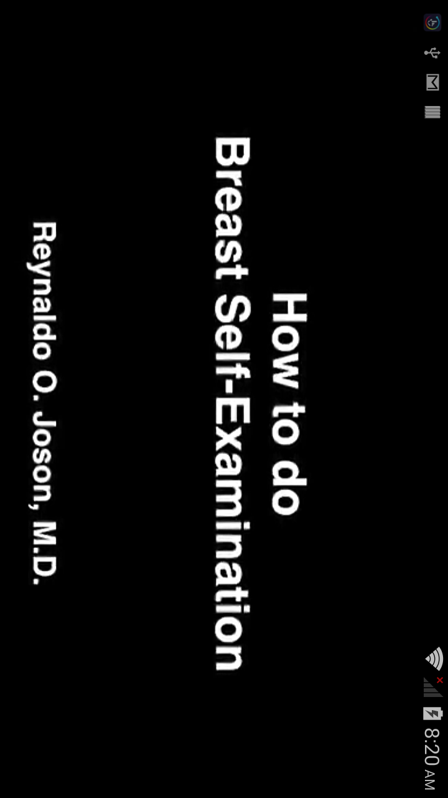
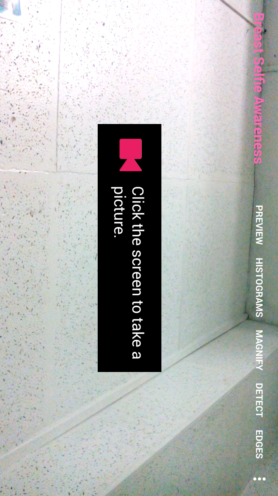

# Dibdib Advocacy 

Dibdib Advocacy App (v2.0) is a Breast Cancer awareness application for spreading awareness and helping Filipino women fight against breast cancer. Breast cancer is the most common cancer affecting women worldwide. Philippines is among the countries with highest trends in incidence of the disease. Majority of deaths occur in low- and middle-income countries, where most women are diagnosed in late stages, due mainly to lack of awareness on early detection, and barriers to health services. This app includes basic facts, risk factors, inspection guide, palpation video, integrated with Google Maps, Android's Text-to-Speech API and Image processing, providing a fully integrated app experience. 

This app is developed and maintained by the Intelligent Systems Laboratory of De La Salle University-Manila under the Philippine Commission of Higher Education (CHED)- Philippine Research Network (PHERNET) Sustainability Studies Program.   


# INCLUDES:
- Basic Breast Cancer Facts and Recommendation
- Common Risk Factors
- Tips on lowering the risk
- Visual inspection guide
- Breast Palpation instructions
- Breast Self-Examination video demo 
- Google Map/Places Integration for neighboring hospital search and route guide
- Breast Selfie's (with RGB Preview, Color Histograms, Magnification, Breast Detection by Haar Cascades, Edge detection and Image Gradients based on OpenCV samples)
- Speech-based User Interface feedback (using Android's Text-to-Speech API)


# GOOGLE PLAY

https://play.google.com/store/apps/details?id=com.cabatuan.breastfriend 


# CORE APP DEVELOPER:
```text
Melvin K. Cabatuan
Member, Intelligent Systems Laboratory
Mobile Application Development Team Leader
Email: melvincabatuan@gmail.com
All Rights Reserved
```

# MEDICAL CONSULTANTS

- Dr. Jose Ma. C. Avila, MD, a former member of the Editorial Board of Western Pacific Region Index Medicus (WPRIM) and present chairman of the Philippine Journal Selection Committee to WPRIM. He is a member of the Research Utilization Committee of the Philippine Council for Health Research and Development (PCHRD). He is also the former Chairman and a Professor of the Department of Pathology, College of Medicine, University of the Philippines, Manila. Dr. Avila was President of the Philippine Society of Pathologists from 2002-2003 and was Chief of the Surgical Pathology Section of the Department of Laboratories, Philippine General Hospital from 2003-2006. He was also a recipient of various awards for outstanding research and publication.

- Dr. Reynaldo O. Joson, MD, MHA, MHPEd, MSc Surg with specialization in Breast Surgery, General Surgery, Head and Neck Surgery, Surgery, Surgical Oncology. (Years in practice: 40 years) . Dr. Joson practices at Manila Doctors Hospital in Manila, Metro Manila. He completed Doctor of Medicine from University of the Philippines Manila in 1974 and Fellowship Training from Philippine College of Surgeon in 1982. He is also a member of Philippine Medical Association.


# ACKNOWLEDGMENT:
- Philippine Commission of Higher Education (CHED)- Philippine Research Network (PHERNET) Sustainability Studies Program for the gracious funding of this project.
- Breast Cancer Awareness Integrated/Intelligent Multimedia System idea by Dr. Elmer Dadios, Ph.D, head of Intelligent Systems Laboratory, De La Salle University-Manila, and Dr. Raouf Naguib, Ph. D., BIOCORE Research & Consultancy International, De La Salle University, Carleton University.
- Breast Self-Examination video demo by Dr. Reynaldo O. Joson, MD. and Engr. Anthony Jose.
- Visual inspection infographic from CancerResearch UK (www.cancerresearchuk.org)
- Icons used are GitHub's Octicons (https://github.com/github/octicons) modified with romannurik's Android Asset Studio (https://github.com/romannurik/AndroidAssetStudio).
- Google Android Development Team for the SDK, NDK, and great API's, i.e. Google Map/Places, Text-to-Speech, etc. 
- OpenCV Development Team for the great computer vision library


# LICENSE

```text
The MIT License (MIT)

Copyright (c) Intelligent Systems Laboratory and Melvin Cabatuan

Permission is hereby granted, free of charge, to any person obtaining a copy
of this software and associated documentation files (the "Software"), to deal
in the Software without restriction, including without limitation the rights
to use, copy, modify, merge, publish, distribute, sublicense, and/or sell
copies of the Software, and to permit persons to whom the Software is
furnished to do so, subject to the following conditions:

The above copyright notice and this permission notice shall be included in all
copies or substantial portions of the Software.

THE SOFTWARE IS PROVIDED "AS IS", WITHOUT WARRANTY OF ANY KIND, EXPRESS OR
IMPLIED, INCLUDING BUT NOT LIMITED TO THE WARRANTIES OF MERCHANTABILITY,
FITNESS FOR A PARTICULAR PURPOSE AND NONINFRINGEMENT. IN NO EVENT SHALL THE
AUTHORS OR COPYRIGHT HOLDERS BE LIABLE FOR ANY CLAIM, DAMAGES OR OTHER
LIABILITY, WHETHER IN AN ACTION OF CONTRACT, TORT OR OTHERWISE, ARISING FROM,
OUT OF OR IN CONNECTION WITH THE SOFTWARE OR THE USE OR OTHER DEALINGS IN THE
SOFTWARE.
```

# VIDEOCAPTURES

[](https://youtu.be/p6PartliODg)

[](https://youtu.be/booLbrq6S_E)

[](https://youtu.be/Blg-VcrKGOs)

# SELECTED SCREENSHOTS








# REFERENCES:

[1] International Agency for Research on Cancer (IARC) and Cancer Research UK."
World Cancer Factsheet". Cancer Research UK, London, 2012.

[2] World Health Organization. http://www.who.int 

[3] THE GLOBOCAN PROJECT, International Agency for Research on Cancer (IARC)/WHO. http://globocan.iarc.fr

[4] Philippine College of Surgeons. http://pcs.org.ph

[5] Philippine Breast Cancer Network. http://www.pbcn.org

[6] M.H. Forouzanfar, K.J. Foreman, A.M. Delossantos, R. Lozano, A.D. Lopez, C.J.L.
Murray, M. Naghavi, "Breast and cervical cancer in 187 countries between 1980 and 2010:
a systematic analysis," The Lancet, Volume 378, Issue 9801, pp. 1461 - 1484, 22, 2011.

[7] Department of Health, National Epidemiology Center, National Health Statistics Report
2008 and 2009.

[8] Yip C. H. "Breast cancer in Asia", Dept. of Surgery University Malaya Medical Centre,
Lecture Presentation, 2012.

[9] P. Pisani, D.M. Parkin, C. Ngelangel, D. Esteban, L. Gibson, M. Munson, M.G. Reyes
and A. Laudico. Outcome of screening by clinical examination of the breast in a trial in the
Philippines. Int. J. Cancer, 118:149-154, 2006.

[10] ICANSERVE Foundation. http://www.icanservefoundation.org

[11] Dr. Reynaldo O. Joson's Medical blog. https://rojosonmedicalclinic.wordpress.com


*"Natural mind can replace almost every level of education, but no education can replace the natural mind."* - Arthur Schopenhauer
