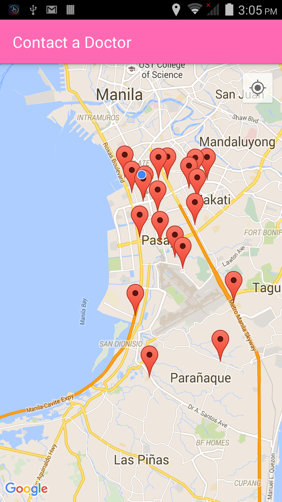
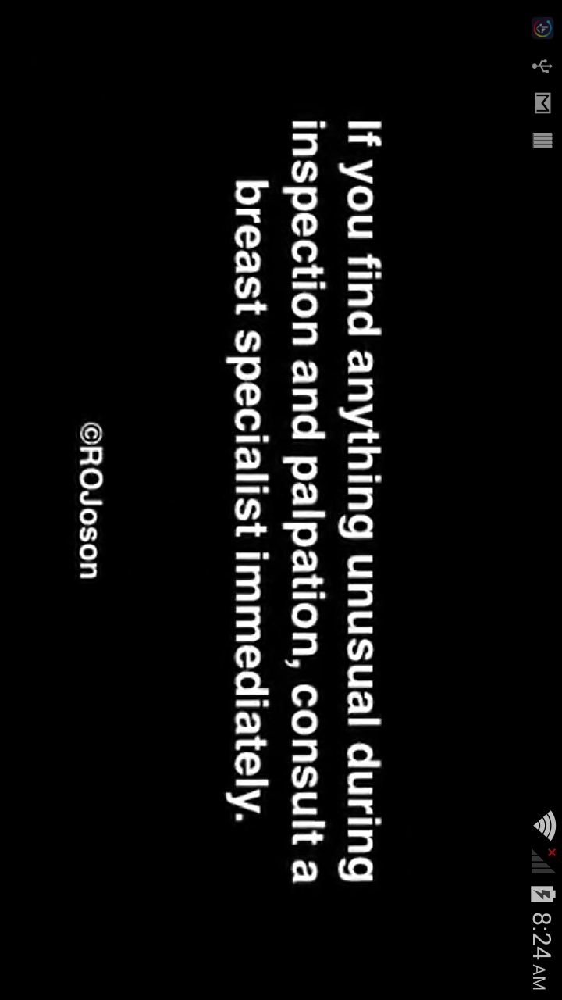
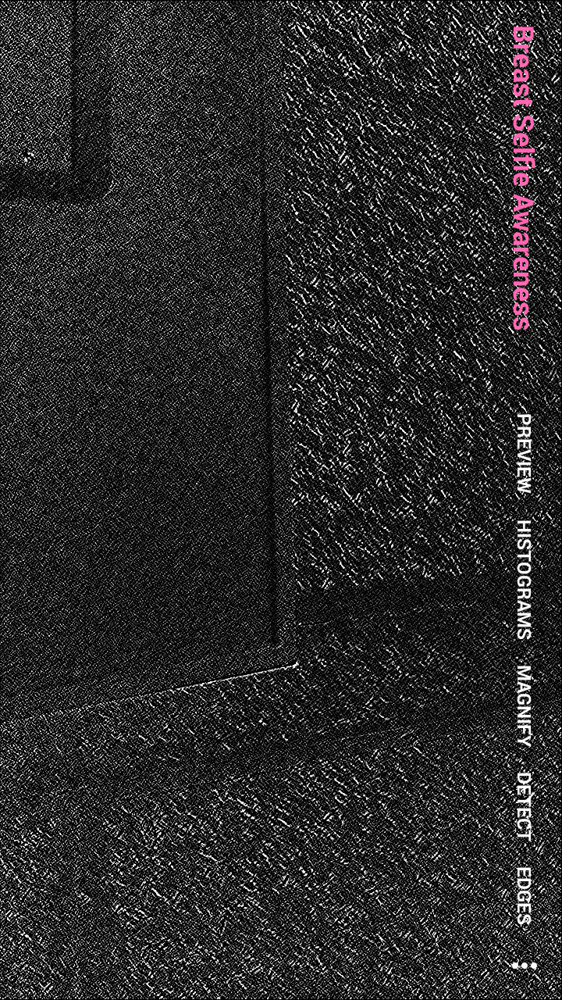

# Dibdib Advocacy v1.0 (Alpha)

Dibdib Advocacy App v1.0 is a Breast Cancer awareness application with the main goal of spreading awareness and helping Filipino women fight against breast cancer. This app is developed and maintained by the Intelligent Systems Laboratory of De La Salle University under the Philippine Commission of Higher Education (CHED)- Philippine Research Network (PHERNET) Sustainability Studies Program.   


# INCLUDES:
- Basic Breast Cancer Facts and Recommendation
- Common Risk Factors
- Tips on lowering the risk
- Visual inspection guide
- Breast Palpation instructions
- Breast Self-Examination video demo 
- Google Map/Places Integration for neighboring hospital search and route guide
- Breast Selfie's (with RGB Preview, Color Histograms, Magnification, Breast Detection by Haar Cascades, Edge detection and Image Gradients based on OpenCV samples)
- Speech-based User Interface feedback (using Android's Text-to-Speech API)


# CORE APP DEVELOPER:

Melvin K. Cabatuan
Member, Intelligent Systems Laboratory
Mobile Application Development Team Leader
Email: melvincabatuan@gmail.com
All Rights Reserved

# LICENSE

```text
The MIT License (MIT)

Copyright (c) Melvin Cabatuan

Permission is hereby granted, free of charge, to any person obtaining a copy
of this software and associated documentation files (the "Software"), to deal
in the Software without restriction, including without limitation the rights
to use, copy, modify, merge, publish, distribute, sublicense, and/or sell
copies of the Software, and to permit persons to whom the Software is
furnished to do so, subject to the following conditions:

The above copyright notice and this permission notice shall be included in all
copies or substantial portions of the Software.

THE SOFTWARE IS PROVIDED "AS IS", WITHOUT WARRANTY OF ANY KIND, EXPRESS OR
IMPLIED, INCLUDING BUT NOT LIMITED TO THE WARRANTIES OF MERCHANTABILITY,
FITNESS FOR A PARTICULAR PURPOSE AND NONINFRINGEMENT. IN NO EVENT SHALL THE
AUTHORS OR COPYRIGHT HOLDERS BE LIABLE FOR ANY CLAIM, DAMAGES OR OTHER
LIABILITY, WHETHER IN AN ACTION OF CONTRACT, TORT OR OTHERWISE, ARISING FROM,
OUT OF OR IN CONNECTION WITH THE SOFTWARE OR THE USE OR OTHER DEALINGS IN THE
SOFTWARE.
```

# VIDEOCAPTURE

[](https://youtu.be/p6PartliODg)

# SELECTED SCREENSHOTS











# ACKNOWLEDGMENT:
- Breast Self-Examination video demo by Dr. Reynaldo O. Joson, MD. and Engr. Anthony Jose.
- Visual inspection infographic from CancerResearch UK (www.cancerresearchuk.org)
- Icons used are GitHub's Octicons (https://github.com/github/octicons) modified with romannurik's Android Asset Studio (https://github.com/romannurik/AndroidAssetStudio).
- Google Android Development Team for the SDK, NDK, and great API's, i.e. Google Map/Places, Text-to-Speech, etc. 
- OpenCV Development Team for the great computer vision library


# REFERENCES:

[1] International Agency for Research on Cancer (IARC) and Cancer Research UK."
World Cancer Factsheet". Cancer Research UK, London, 2012.

[2] World Health Organization. http://www.who.int 

[3] THE GLOBOCAN PROJECT, International Agency for Research on Cancer (IARC)/WHO. http://globocan.iarc.fr

[4] Philippine College of Surgeons. http://pcs.org.ph

[5] Philippine Breast Cancer Network. http://www.pbcn.org

[6] M.H. Forouzanfar, K.J. Foreman, A.M. Delossantos, R. Lozano, A.D. Lopez, C.J.L.
Murray, M. Naghavi, "Breast and cervical cancer in 187 countries between 1980 and 2010:
a systematic analysis," The Lancet, Volume 378, Issue 9801, pp. 1461 - 1484, 22, 2011.

[7] Department of Health, National Epidemiology Center, National Health Statistics Report
2008 and 2009.

[8] Yip C. H. "Breast cancer in Asia", Dept. of Surgery University Malaya Medical Centre,
Lecture Presentation, 2012.

[9] P. Pisani, D.M. Parkin, C. Ngelangel, D. Esteban, L. Gibson, M. Munson, M.G. Reyes
and A. Laudico. Outcome of screening by clinical examination of the breast in a trial in the
Philippines. Int. J. Cancer, 118:149-154, 2006.

[10] ICANSERVE Foundation. http://www.icanservefoundation.org

[11] Dr. Reynaldo O. Joson's Medical blog. https://rojosonmedicalclinic.wordpress.com
